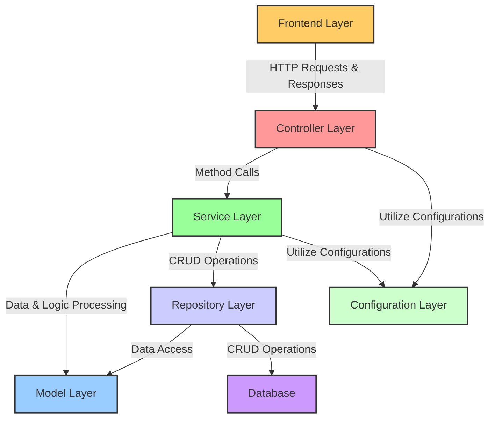

# O'Reilly Clone
An e-commerce platform inspired by O'Reilly, implemented using Spring Boot and Spring Data JPA for the backend.

# Overview
This project is structured into several layers, ensuring a clean architecture and separation of concerns:
1. Backend Layer: Implements business logic, API endpoints, and data management with Spring Boot.
2. Configuration Layer: Handles application configuration, security settings, and JWT token management.
3. Build & Dependency Management: Utilizes Gradle for dependency management and project building.

# System Architecture
## N-Tier Architecture
* Controller Layer: Manages API endpoints and HTTP request handling.
* Service Layer: Contains business logic and interacts with models and repositories for data access.
* Model Layer: Defines data structures and ORM entities.
* Repository Layer: Manages data access, potentially interacting with a database.
* Configuration Layer: Manages application configuration, such as security settings and JWT token management.

# Contact
Chris_Saechao@live.com
Project Link: https://o-reilly-2-0.vercel.app/
