# O'Reilly Clone
An e-commerce platform inspired by O'Reilly, implemented using Spring Boot and Spring Data JPA for the backend.

# Overview
This project is structured into several layers, ensuring a clean architecture and separation of concerns:
1. Backend Layer: Implements business logic, API endpoints, and data management with Spring Boot.
2. Configuration Layer: Handles application configuration, security settings, and JWT token management.
3. Build & Dependency Management: Utilizes Gradle for dependency management and project building.

# System Architecture
## N-Tier Architecture
* Controller Layer: Manages API endpoints and HTTP request handling.
* Service Layer: Contains business logic and interacts with models and repositories for data access.
* Model Layer: Defines data structures and ORM entities.
* Repository Layer: Manages data access, potentially interacting with a database.
* Configuration Layer: Manages application configuration, such as security settings and JWT token management.

```mermaid
graph TB
    ViewLayer[View Layer]
    ApplicationLayer[Application Layer]
    ShoppingAPI[ShoppingAPI]
    DataAccessObject[DataAccessObject]
    model[Model Layer]
    database[Database]
    Auth[Authentication Layer]

    ViewLayer -->|HTTP Requests & Responses| ApplicationLayer
    ApplicationLayer -->|Method Calls| ShoppingAPI
    ShoppingAPI -->|Data & Logic Processing| model
    ShoppingAPI -->|CRUD Operations| DataAccessObject
    DataAccessObject -->|Data Access| model
    DataAccessObject -->|CRUD Operations| database
    ApplicationLayer -->|Utilize Auth| Auth
    ShoppingAPI -->|Utilize Auth| Auth

    style ViewLayer fill:#000000,stroke:#333,stroke-width:2px
    style ApplicationLayer fill:#000000,stroke:#333,stroke-width:2px
    style ShoppingAPI fill:#000000,stroke:#333,stroke-width:2px
    style DataAccessObject fill:#000000,stroke:#333,stroke-width:2px
    style model fill:#000000,stroke:#333,stroke-width:2px
    style database fill:#000000,stroke:#333,stroke-width:2px
    style Auth fill:#000000,stroke:#333,stroke-width:2px
```

## System Interaction Summary
1. Frontend Layer
Responsibility: Manages user interface and experience.
Interaction: Communicates with the backend through HTTP requests and updates the UI based on the responses.
2. Backend Layer
    1. Controller Layer
        1. Responsibility: Handles HTTP requests and responses.
        2. Interaction: Receives requests from the frontend, interacts with the service layer for data processing, and sends back responses.
    2. Service Layer
        1. Responsibility: Manages business logic and data processing.
        2. Interaction: Communicates with the controller layer and accesses/modifies data through the repository layer, utilizing models for data structure.
    3. Model Layer
        1. Responsibility: Defines data structures.
        2. Interaction: Used by the service and repository layers to define and manage data.
    4. Repository Layer
        1. Responsibility: Manages data access and CRUD operations.
        2. Interaction: Interacts with the database and the service layer, using models to manage data.
3. Auth Layer
    1. Responsibility: Secures rest endpoints.
    2. Interaction: Provides authentication settings (like security and JWT management) to the controller and service layers.

### Interaction Flow:
The Frontend Layer sends HTTP requests to the Controller Layer and receives responses to update the UI. The Controller Layer communicates with the Service Layer to process requests and manage business logic.
The Service Layer interacts with the Repository Layer to access and manage data in the database, utilizing the Model Layer for data structures. The Repository Layer performs CRUD operations directly on the Database. Both the Controller and Service Layers utilize configurations from the Auth Layer.
